# ERD — Sewain

> Turunan dari [`02-business-rules.md`](./02-business-rules.md) dan
> [`01-product-requirements.md`](./01-product-requirements.md) §6.
> Tiap tabel menyebut BR yang menjadikannya ada. Kalau ada kolom yang tidak bisa
> ditunjuk BR-nya, kolom itu kandidat untuk dihapus.

---

## 1. Diagram

```mermaid
erDiagram
    owners ||--o{ users : "punya"
    owners ||--o{ resources : "punya"
    owners ||--o{ customers : "punya"
    owners ||--|| subscriptions : "berlangganan"
    owners ||--o{ booking_counters : "penomoran"
    owners ||--o{ api_keys : "kunci API eksternal (BR-031)"
    users  ||--o{ refresh_tokens : "sesi"

    resources ||--o{ resource_units : "unit fisik"
    resources ||--o| vehicle_specs : "spek kendaraan (BR-094)"
    resource_units ||--o| vehicle_unit_details : "detail kendaraan (BR-094)"
    resources ||--o{ bookings : "jenis"
    resource_units ||--o{ bookings : "dibooking"
    customers ||--o{ bookings : "penyewa"

    bookings ||--o{ handovers : "bukti kondisi"
    bookings ||--o{ invoices : "ditagih"
    bookings ||--o{ notifications : "diingatkan"
    handovers ||--o{ handover_photos : "foto"

    invoices ||--|{ invoice_lines : "rincian"
    invoices ||--o{ payments : "dibayar"
    invoices ||--o{ payment_gateway_transactions : "transaksi gateway"
    invoices ||--o{ payment_proofs : "bukti transfer"
    handover_photos ||--o{ invoice_lines : "rujukan damage"
    subscriptions ||--o{ invoices : "tagihan langganan"

    owners {
        uuid id PK
        text slug UK "NULL = tanpa halaman publik; usaha+ (BR-025, BR-080)"
        text name
        text status "active | suspended"
        bool require_payment_before_pickup "BR-038, default false"
        int  draft_expiry_hours "BR-027, default 24"
        int  payment_due_hours "BR-057, default 24"
        int  no_show_tolerance_hours "BR-057, default 3 = bebas hari itu juga"
        bool notify_pickup_reminder "BR-070"
        bool notify_return_reminder "BR-070"
        bool notify_overdue_reminder "BR-070"
        text_array allowed_origins "BR-031, default kosong = tidak ada origin lintas-domain"
        text booking_code_prefix "BR-024, 2-6 huruf besar/angka, default SWN"
        text business_type "BR-017, preset pasar; menentukan pricing_unit resource"
        text whatsapp "BR-096, NULL = halaman publik belum bisa hidup; format +62 ditegakkan"
        text address "BR-096, lokasi ambil default"
        text operating_hours "BR-096, teks bebas; jam buka rental penuh pengecualian"
    }

    api_keys {
        uuid id PK
        uuid owner_id FK
        text name "situs rentalbudi.com"
        text key_prefix UK "8 char pertama, untuk ditampilkan"
        text key_hash "argon2id; rahasianya tidak pernah disimpan (BR-031)"
        int  rate_limit_per_min "default 60"
        timestamptz last_used_at
        timestamptz revoked_at "dicabut, tidak dihapus"
        uuid created_by FK
    }

    users {
        uuid id PK
        uuid owner_id FK "satu user, satu usaha (BR-004)"
        text email UK "unik GLOBAL - itu yang bikin login cukup email+password"
        text password_hash "null selama undangan belum diterima"
        text name
        text phone
        text role "owner | operator (BR-003)"
        text status "invited | active | disabled"
        timestamptz email_verified_at "BR-006, NULL = belum terverifikasi"
    }

    refresh_tokens {
        uuid id PK
        uuid owner_id FK
        uuid user_id FK "FK komposit ke users(id, owner_id) - lihat §3"
        text token_hash UK "sha256; plaintext cuma ada di cookie"
        uuid rotated_from FK "rantai rotasi; dipakai ulang = pencurian"
        timestamptz expires_at
        timestamptz revoked_at
    }

    subscriptions {
        uuid id PK
        uuid owner_id FK
        text plan "trial | usaha | bisnis (BR-080) - DITUNDA, tabel tetap kosong di fase 1"
        int  unit_quota
        int  user_quota
        text status "active | past_due | cancelled"
        timestamptz current_period_end
    }

    resources {
        uuid id PK
        uuid owner_id FK
        text name
        text category "diisi SERVER dari vehicle_specs.vehicle_type (BR-094)"
        text_array images
        text description "fitur & perlengkapan; dirender halaman publik (BR-095)"
        text terms_excludes "belum termasuk; NULL = tidak ditampilkan (BR-095)"
        text terms_requirements "syarat sewa (BR-095)"
        text terms_cancellation "pembatalan & perubahan (BR-095)"
        text pricing_unit "hour|day|week|month; diisi SERVER dari preset pemilik (BR-012, BR-017)"
        bigint base_price
        bigint deposit_amount "NULL = tanpa deposit (BR-016)"
        bigint late_fee_per_unit "NULL = tanpa denda telat (BR-016)"
        int  buffer_minutes "NOT NULL default 0 (BR-015) - satu-satunya yang tidak nullable"
        int  min_duration "NULL = tanpa batas bawah (BR-016)"
        int  max_duration "NULL = tanpa batas atas (BR-016)"
        bool requires_id_verification "NOT NULL default false"
        text status "active | inactive"
    }

    resource_units {
        uuid id PK
        uuid owner_id FK
        uuid resource_id FK
        text code "unik per owner (BR-011)"
        text label
        text status "active | maintenance | retired (BR-013)"
        bigint meter_value
        text condition_notes
    }

    vehicle_specs {
        uuid resource_id PK "1:1, sekaligus FK komposit ke resources (BR-094)"
        uuid owner_id FK
        text vehicle_type "car | motorcycle; DIKUNCI sesudah dibuat (BR-094)"
        text transmission "manual | automatic | clutch; clutch hanya motor"
        int seats "2-20; WAJIB mobil, DILARANG motor"
        text fuel "gasoline | diesel | hybrid | electric; diesel hanya mobil"
    }

    vehicle_unit_details {
        uuid resource_unit_id PK "1:1, sekaligus FK komposit ke resource_units (BR-094)"
        uuid owner_id FK
        int year "1990-2100 di database; 'tahun depan' divalidasi aplikasi"
        text color
        date tax_due_on "hanya dilihat juragan, tidak pernah publik"
        date registration_valid_until "idem"
    }

    customers {
        uuid id PK
        uuid owner_id FK
        text name
        text phone
        text id_type "ktp | sim | passport"
        bytea id_number_enc "AES-256-GCM aplikasi, kunci IDENTITY_ENC_KEY (BR-085)"
        text id_number_last4 "empat digit terakhir, untuk mencocokkan kartu tanpa membuka enkripsi"
        text id_photo_key "kunci objek; terenkripsi at-rest di R2, bukan aplikasi (BR-085)"
        bool is_blacklisted "BR-028"
        text blacklist_reason
        timestamptz id_purge_after "BR-086 - DITUNDA, tidak dibaca job mana pun di fase 1"
    }

    bookings {
        uuid id PK
        uuid owner_id FK
        text code "<prefix pemilik>-nnnn, unik per owner (BR-024)"
        uuid customer_id FK
        uuid resource_id FK
        uuid resource_unit_id FK
        timestamptz start_at
        timestamptz end_at
        timestamptz end_at_with_buffer "diisi trigger, bukan aplikasi (BR-022)"
        text status "draft|reserved|picked_up|returned|completed|cancelled|no_show"
        text source "staff | public_page (BR-030)"
        bigint unit_price "snapshot (BR-014)"
        text pricing_unit "snapshot"
        int  buffer_minutes "snapshot (BR-015)"
        int  duration_qty
        bigint subtotal
        bigint deposit_amount "snapshot; NULL = tanpa deposit (BR-016)"
        bigint late_fee_per_unit "snapshot; NULL = tanpa denda (BR-016)"
        timestamptz deposit_waived_at "BR-051"
        uuid deposit_waived_by FK "BR-051"
        text deposit_waiver_reason "BR-051, wajib bila dibebaskan"
        timestamptz actual_return_at "diisi server (BR-040)"
        bigint deposit_deducted
        bigint deposit_refunded
        text deposit_note
        timestamptz expires_at "BR-027, hanya untuk draft"
        text cancelled_reason
    }

    handovers {
        uuid id PK
        uuid owner_id FK
        uuid booking_id FK
        text direction "pickup | return (BR-035)"
        uuid performed_by FK
        timestamptz performed_at
        bigint meter_value "BR-036"
        jsonb checklist
        text condition_notes
        bigint late_fee_waived "BR-051, hanya arah return"
        text waiver_reason "BR-051, berpasangan dengan late_fee_waived"
    }

    handover_photos {
        uuid id PK
        uuid owner_id FK "BR-001; invoice_lines merujuk baris ini lintas tabel"
        uuid handover_id FK
        text object_key "kunci objek R2, bukan URL"
        timestamptz captured_at
    }

    invoices {
        uuid id PK
        uuid owner_id FK
        text kind "booking | subscription (BR-082)"
        uuid booking_id FK "null untuk langganan"
        uuid subscription_id FK "null untuk sewa"
        uuid customer_id FK
        text number "UK per owner: <kode booking>/<n>"
        text status "unpaid|gateway_pending|paid|overdue|cancelled (BR-056); gateway_pending tak terjangkau di fase 1"
        timestamptz due_at "BR-057: min(created_at + payment_due_hours, booking.start_at)"
        timestamptz paid_at
    }

    invoice_lines {
        uuid id PK
        uuid owner_id FK
        uuid invoice_id FK
        text kind "rent|deposit|late_fee|damage|discount (BR-055)"
        text description
        bigint amount "discount negatif"
        uuid handover_photo_id FK "wajib bila kind=damage (BR-047)"
        text waiver_reason "BR-046"
    }

    payments {
        uuid id PK
        uuid owner_id FK
        uuid invoice_id FK
        text method "gateway | manual_transfer | cash; gateway tak terjangkau di fase 1"
        bigint amount
        text status "success | failed (BR-060)"
        timestamptz paid_at
        uuid approved_by FK
    }

    payment_gateway_transactions {
        uuid id PK
        uuid owner_id FK
        uuid invoice_id FK
        text provider
        text external_id "unik per provider (BR-063)"
        text status
        jsonb raw_payload
        bool signature_verified "BR-063, BR-064"
    }

    payment_proofs {
        uuid id PK
        uuid owner_id FK
        uuid invoice_id FK
        text object_key
        bigint ai_amount "rekomendasi (BR-062)"
        timestamptz ai_paid_at
        text match_status "match | mismatch | unreadable"
        uuid reviewed_by FK
        timestamptz reviewed_at
    }

    notifications {
        uuid id PK
        uuid owner_id FK
        uuid booking_id FK
        text kind "invoice_link | payment_due_reminder | pickup_reminder | return_reminder | overdue (BR-070)"
        text recipient_phone
        date scheduled_date "BR-071: satu per hari"
        int  attempt_no "BR-071: maksimal 3"
        text provider_message_id UK "wamid dari Meta; korelasi webhook status (BR-073)"
        text status "pending | sent | failed"
        text failure_reason "BR-072"
    }

    booking_counters {
        uuid owner_id PK "BR-024; satu baris per pemilik"
        bigint last_number "hanya naik, tidak pernah turun"
    }

    audit_logs {
        uuid id PK
        uuid owner_id FK
        uuid actor_user_id FK
        text action "mis. customer.identity.viewed (BR-085)"
        text entity
        uuid entity_id
        jsonb metadata
    }
```



---

## 2. Aturan yang berlaku di semua tabel

| Aturan | Alasan |
|---|---|
| PK `uuid` | PRD §6.7 |
| Semua tabel bertenant punya `owner_id` + index, **`ENABLE` + `FORCE ROW LEVEL SECURITY`**, dan policy `owner_isolation` — penegakannya database, bukan filter di query (§3) | BR-001 |
| Uang `bigint` rupiah penuh, tidak pernah float | PRD §6.7 |
| `created_at`, `updated_at`, `created_by` | PRD §9 |
| `deleted_at` (soft delete) **kecuali** `handovers`, `handover_photos`, `payment_gateway_transactions`, `audit_logs` | BR-037, BR-063 |
| Waktu `timestamptz`, disimpan UTC | — |

Tiga tabel sengaja **tanpa** jalur ubah/hapus di API mana pun: `handovers`,
`handover_photos`, `audit_logs` (BR-037, BR-085).

**Tepat satu tabel sengaja tanpa `owner_id`, jadi sengaja tanpa RLS: `owners`.** Ia
**adalah** tenant-nya — `id`-nya yang jadi `owner_id` di tabel lain, jadi kolom itu tidak
punya arti di sini. `make lint-rls` melewatinya karena ia memang mencari kolom `owner_id`;
tidak ada kolomnya, tidak ada yang diperiksa.

`users` dan `refresh_tokens` **ikut ber-RLS seperti tabel lain** (BR-004). Keduanya dibaca
sebelum konteks owner ada — login cuma punya email, refresh cuma punya cookie — jadi query
biasa di titik itu mendapat nol baris. Yang menjembataninya dua fungsi `SECURITY DEFINER`
di §3, bukan pengecualian RLS.

---

## 3. Constraint yang memikul kebenaran

Yang di bawah ini bukan optimasi — kalau hilang, aturan bisnisnya ikut hilang.

`docs/03-verify-overlap-constraint.sql` adalah **bukti berjalan** untuk seluruh blok ini: ia membuat
tabelnya di database scratch, menjalankan 6 kasus, lalu `ROLLBACK` — tidak meninggalkan apa pun.
Bisa dijalankan **sebelum migrasi apa pun ada**, jadi risiko terbesar proyek (`S1-022`) bisa diuji
di minggu 1:

```bash
createdb sewain_scratch && psql sewain_scratch -f docs/03-verify-overlap-constraint.sql
```

**Constraint sisanya punya skripnya sendiri:** `docs/03-verify-constraints.sql` — pola
sama: **79 `NOTICE OK` constraint plus 6 `NOTICE OK RLS`** yang membuktikan isolasi BR-001.
Kasusnya 79 untuk 81 constraint: beberapa diuji dari dua arah, dan empat target `UNIQUE (id, owner_id)` diuji lewat FK yang menunjuknya — menolak yang salah **dan**
menerima yang benar, supaya constraint yang kebablasan ikut ketahuan.
Yang RLS diuji dari **peran non-superuser**: superuser melewati RLS sepenuhnya, `FORCE`
sekalipun, jadi mengujinya sebagai diri sendiri akan lulus secara palsu. Tabel di dalamnya sengaja minimal (hanya kolom yang
disentuh constraint); ia harness, bukan skema. **Kalau kamu mengubah constraint di bawah, ubah
juga di sana** — CI menjalankan keduanya (`S1-069`), jadi constraint yang di-drop seseorang nanti
bikin PR merah alih-alih ketahuan di produksi.

```bash
psql sewain_scratch -f docs/03-verify-constraints.sql
```

```sql
CREATE EXTENSION IF NOT EXISTS btree_gist;

-- BR-001: isolasi pemilik ditegakkan database. Satu fungsi, dipanggil setiap
-- migrasi yang membuat tabel ber-owner_id -- JANGAN tulis tangan keempat
-- statement-nya, karena mode gagal FORCE yang hilang itu senyap.
CREATE OR REPLACE FUNCTION enable_owner_rls(tbl regclass)
RETURNS void LANGUAGE plpgsql AS $fn$
BEGIN
  IF NOT EXISTS (SELECT 1 FROM information_schema.columns
                 WHERE table_name = tbl::text AND column_name = 'owner_id') THEN
    RAISE EXCEPTION 'enable_owner_rls: % tidak punya kolom owner_id', tbl;
  END IF;

  EXECUTE format('ALTER TABLE %s ENABLE ROW LEVEL SECURITY', tbl);
  EXECUTE format('ALTER TABLE %s FORCE  ROW LEVEL SECURITY', tbl);
  EXECUTE format($p$
    CREATE POLICY owner_isolation ON %s
      USING      (owner_id = NULLIF(current_setting('app.owner_id', true), '')::uuid)
      WITH CHECK (owner_id = NULLIF(current_setting('app.owner_id', true), '')::uuid)
  $p$, tbl);
END $fn$;

-- NULLIF wajib: current_setting(..., true) mengembalikan NULL kalau belum pernah
-- di-set (baik -- owner_id = NULL menyaring semua baris, gagal-tertutup), TAPI
-- mengembalikan '' kalau di-set ke string kosong, dan ''::uuid melempar error.
--
-- FORCE bukan pelengkap ENABLE. Tanpanya, pemilik tabel melewati policy-nya
-- sendiri -- dan peran itu yang menjalankan migrasi. Tidak ada yang terlihat rusak.
-- Superuser melewati RLS sepenuhnya, FORCE sekalipun: aplikasi WAJIB tersambung
-- sebagai peran non-superuser yang tidak memiliki tabel apa pun (`app_user`).
--
-- WITH CHECK bukan duplikat USING, dan menghapusnya membuka lubang yang tidak
-- terlihat dari mana pun: USING TIDAK diterapkan pada INSERT. Dengan USING saja,
-- membaca baris pemilik lain mustahil -- tapi MENULIS baris ber-owner_id pemilik
-- lain berhasil tanpa error. Barisnya masuk, lalu hilang dari pandangan si penulis
-- karena USING menyaringnya kembali. BR-001 melarang owner_id datang dari request,
-- tapi itu disiplin aplikasi; FORCE ada justru karena disiplin aplikasi tidak cukup.
-- Kasus RLS 5/6 di 03-verify-constraints.sql yang membuktikannya.
-- BR-004: dua pembacaan yang jalan SEBELUM konteks owner ada.
--
-- `users` dan `refresh_tokens` dua-duanya ber-RLS (§2), dan dua-duanya harus dibaca
-- sebelum siapa pun tahu usahanya: login cuma punya email, refresh cuma punya cookie.
-- Query biasa di titik itu membandingkan owner_id dengan setting yang NULL dan
-- mendapat nol baris. Sesuatu harus menembusnya, tepat dua kali.
--
-- SECURITY DEFINER saja TIDAK cukup. FORCE ROW LEVEL SECURITY mengikat pemilik tabel
-- juga, jadi fungsi milik pemilik skema tetap tersaring -- kecuali pemilik itu
-- kebetulan superuser, yang benar di mesin developer dan tidak boleh diandalkan di
-- produksi. Karena itu keduanya dimiliki peran ber-BYPASSRLS yang tidak memiliki
-- apa pun selain dua fungsi ini.
--
-- Yang menjaga keduanya tetap kecil adalah tipe baliknya: kolom dikunci saat definisi.
-- auth_lookup_user tidak mengembalikan nama maupun email; auth_lookup_refresh_token
-- tidak mengembalikan token material sama sekali. Melebarkan salah satunya adalah
-- perubahan skema DAN perubahan kontrak.
--
-- Tidak akan ada yang ketiga. Menambahnya adalah percakapan, bukan satu baris.
CREATE ROLE auth_lookup NOLOGIN BYPASSRLS;
GRANT SELECT (id, owner_id, password_hash, status, role, email) ON users          TO auth_lookup;
GRANT SELECT (id, owner_id, user_id, token_hash, expires_at, revoked_at)
                                                             ON refresh_tokens TO auth_lookup;

CREATE FUNCTION auth_lookup_user(p_email citext)
RETURNS TABLE (id uuid, owner_id uuid, password_hash text, status text, role text)
LANGUAGE sql STABLE SECURITY DEFINER
-- Dipatok supaya pemanggil tidak bisa membayangi `users` dengan tabelnya sendiri
-- lebih awal di search path. Wajib di setiap SECURITY DEFINER.
SET search_path = pg_catalog, public
AS $$
  SELECT u.id, u.owner_id, u.password_hash, u.status, u.role
    FROM users u WHERE u.email = p_email;
$$;

-- Refresh menghadapi masalah yang sama: ia dipanggil JUSTRU karena access token-nya
-- sudah kedaluwarsa, jadi tidak ada owner di mana pun.
--
-- Alternatif yang ditolak: menaruh owner_id di cookie di sebelah token. Itu bekerja --
-- owner yang salah membuat lookup hash-nya meleset -- tapi artinya owner datang dari
-- request, dan BR-001 bilang owner tidak pernah datang dari request. Satu fungsi
-- sempit lagi di tempat yang sama lebih konsisten daripada mekanisme kedua yang beda.
CREATE FUNCTION auth_lookup_refresh_token(p_token_hash text)
RETURNS TABLE (id uuid, owner_id uuid, user_id uuid,
               expires_at timestamptz, revoked_at timestamptz)
LANGUAGE sql STABLE SECURITY DEFINER
SET search_path = pg_catalog, public
AS $$
  SELECT t.id, t.owner_id, t.user_id, t.expires_at, t.revoked_at
    FROM refresh_tokens t WHERE t.token_hash = p_token_hash;
$$;

ALTER FUNCTION auth_lookup_user(citext)         OWNER TO auth_lookup;
ALTER FUNCTION auth_lookup_refresh_token(text)  OWNER TO auth_lookup;
-- EXECUTE diberikan ke PUBLIC secara default pada fungsi baru.
REVOKE ALL  ON FUNCTION auth_lookup_user(citext)        FROM PUBLIC;
REVOKE ALL  ON FUNCTION auth_lookup_refresh_token(text) FROM PUBLIC;
GRANT EXECUTE ON FUNCTION auth_lookup_user(citext)        TO app_user;
GRANT EXECUTE ON FUNCTION auth_lookup_refresh_token(text) TO app_user;

-- BR-001: handover_photos ikut ber-RLS seperti tabel bertenant lain. Ia sempat
-- terlewat karena dijangkau lewat handovers, tapi invoice_lines.handover_photo_id
-- menunjuknya LANGSUNG (BR-047) - jadi tanpa owner_id di sini, satu id foto milik
-- pemilik lain cukup untuk menariknya keluar. Pakai helper-nya, jangan tulis tangan.
SELECT enable_owner_rls('handover_photos');

-- BR-015 + BR-022: buffer dihitung DATABASE, bukan aplikasi.
CREATE OR REPLACE FUNCTION bookings_fill_end_at_with_buffer()
RETURNS trigger LANGUAGE plpgsql AS $fn$
BEGIN
  NEW.end_at_with_buffer := NEW.end_at + make_interval(mins => NEW.buffer_minutes);
  RETURN NEW;
END $fn$;

-- Tanpa daftar kolom, dan BEFORE UPDATE juga: trigger SELALU menimpa, jadi
-- aplikasi tidak bisa menyetel nilainya sendiri walau mengirimnya.
CREATE TRIGGER bookings_end_at_with_buffer
  BEFORE INSERT OR UPDATE ON bookings
  FOR EACH ROW EXECUTE FUNCTION bookings_fill_end_at_with_buffer();

-- Kenapa database, bukan server: kalau aplikasi yang mengisi, satu jalur insert
-- yang lupa menghasilkan buffer 0. Exclusion constraint tetap jalan, tetap tidak
-- bentrok - tapi TANPA jeda bersih-bersih. Gagalnya senyap, persis mode gagal yang
-- RLS dan constraint ada untuk menghapus. Yang tetap tugas server hanyalah
-- men-snapshot buffer_minutes dari resources saat booking dibuat (BR-014, BR-015).

-- KENAPA TRIGGER, BUKAN KOLOM GENERATED — jangan "optimasi" balik.
-- GENERATED ALWAYS AS (end_at + make_interval(...)) STORED DITOLAK PostgreSQL:
--   ERROR: generation expression is not immutable
-- Operator timestamptz + interval ditandai STABLE, bukan IMMUTABLE, karena
-- menambah interval berhari/berbulan ke timestamptz hasilnya tergantung TimeZone
-- sesi saat melewati batas DST. Volatilitas ditandai per-fungsi, jadi tidak
-- menolong bahwa make_interval(mins => ...) kita selalu bebas-DST.
-- Terverifikasi pada PostgreSQL sungguhan, 2026-09-10.

-- BR-022: anti double-booking. Satu-satunya sumber kebenaran.
ALTER TABLE bookings
  ADD CONSTRAINT bookings_no_overlap
  EXCLUDE USING gist (
    resource_unit_id WITH =,
    tstzrange(start_at, end_at_with_buffer, '[)') WITH &&
  )
  WHERE (status IN ('reserved', 'picked_up') AND deleted_at IS NULL);

-- BR-016: NULL = aturannya tidak berlaku. 0 DILARANG, supaya satu keadaan tidak
-- punya dua cara menulisnya - dan supaya "0 karena dipilih" tidak pernah lagi
-- tertukar dengan "0 karena satu jalur insert lupa mengisinya".
ALTER TABLE resources
  ADD CONSTRAINT resources_deposit_positive
    CHECK (deposit_amount    IS NULL OR deposit_amount    > 0),
  ADD CONSTRAINT resources_late_fee_positive
    CHECK (late_fee_per_unit IS NULL OR late_fee_per_unit > 0),
  ADD CONSTRAINT resources_min_duration_positive
    CHECK (min_duration      IS NULL OR min_duration      > 0),
  ADD CONSTRAINT resources_max_duration_positive
    CHECK (max_duration      IS NULL OR max_duration      > 0),
  ADD CONSTRAINT resources_duration_order
    CHECK (min_duration IS NULL OR max_duration IS NULL
           OR max_duration >= min_duration);

-- BR-012 + BR-017: satuan harga dipakai DUA KALI di perhitungan uang - duration_qty
-- dan rumus denda ceil(kelebihan / pricing_unit) di BR-046. Sampai sekarang kolom ini
-- tidak punya penegak apa pun: INSERT yang melewatkannya menghasilkan NULL, dan
-- 'bulan' diterima. Keduanya menghasilkan tagihan yang salah, bukan sekadar data kotor.
ALTER TABLE resources
  ALTER COLUMN pricing_unit SET NOT NULL,
  ALTER COLUMN pricing_unit SET DEFAULT 'day',
  ADD CONSTRAINT resources_pricing_unit_valid
    CHECK (pricing_unit IN ('hour', 'day', 'week', 'month'));

-- BR-017: preset pasar yang dipilih pemilik saat mendaftar. Ia yang menentukan
-- pricing_unit resource; server yang mengisinya, bukan klien.
-- Pemetaan preset -> satuan TIDAK disimpan di sini: itu konfigurasi produk, bukan
-- data tenant. Tabelnya di BR-017, konstantanya di kode.
-- BR-057: tenggat bayar dan toleransi no-show, keduanya knob per pemilik.
-- payment_due_hours harus > 0 - nol berarti invoice jatuh tempo pada detik ia terbit.
-- no_show_tolerance_hours DEFAULT 3: unit bebas hari itu juga tanpa membuat setiap
-- pengambilan normal berlomba dengan job-nya. Boleh diturunkan sampai 0 - karena itu
-- dua kewajiban anti-balapan di BR-057 tetap berlaku berapa pun angkanya.
ALTER TABLE owners
  ALTER COLUMN payment_due_hours       SET NOT NULL,
  ALTER COLUMN payment_due_hours       SET DEFAULT 24,
  ALTER COLUMN no_show_tolerance_hours SET NOT NULL,
  ALTER COLUMN no_show_tolerance_hours SET DEFAULT 3,
  ADD CONSTRAINT owners_payment_due_positive      CHECK (payment_due_hours > 0),
  ADD CONSTRAINT owners_no_show_tolerance_nonneg  CHECK (no_show_tolerance_hours >= 0);

ALTER TABLE owners
  ALTER COLUMN business_type SET NOT NULL,
  ADD CONSTRAINT owners_business_type_valid
    CHECK (business_type IN ('vehicle_rental', 'equipment_rental',
                             'boarding_house', 'apartment', 'venue', 'clinic'));

-- buffer_minutes SENGAJA tidak ikut nullable: end_at + NULL = NULL, dan
-- tstzrange(start_at, NULL) tak berbatas ke atas - unit itu akan bentrok dengan
-- seluruh booking masa depannya. "Tanpa jeda" sudah sama persis dengan 0.
ALTER TABLE resources
  ALTER COLUMN buffer_minutes SET NOT NULL,
  ALTER COLUMN buffer_minutes SET DEFAULT 0,
  ALTER COLUMN requires_id_verification SET NOT NULL,
  ALTER COLUMN requires_id_verification SET DEFAULT false,
  ADD CONSTRAINT resources_buffer_nonneg CHECK (buffer_minutes >= 0);

-- BR-013 + BR-010: status menentukan apakah barisnya ikut dihitung. Unit di luar
-- 'active' hilang dari pencarian ketersediaan, dan resource 'inactive' tidak
-- ditawarkan lagi. Nilai asing tidak menghasilkan error di mana pun -- ia
-- menghasilkan baris yang lenyap diam-diam, mode gagal yang sama persis dengan
-- yang dihapus BR-012 dari pricing_unit.
ALTER TABLE resources ADD CONSTRAINT resources_status_valid
  CHECK (status IN ('active', 'inactive'));
ALTER TABLE resource_units ADD CONSTRAINT resource_units_status_valid
  CHECK (status IN ('active', 'maintenance', 'retired'));

-- Harga dasar tidak pernah negatif: tagihan negatif adalah kelas kesalahan yang
-- sama dengan yang ditutup seluruh blok di atas. NOL DITERIMA, dan bedanya dengan
-- keempat nominal BR-016 ada di NOT NULL-nya -- kolom ini tidak punya NULL yang
-- bisa tertukar dengan 0, jadi "gratis" cuma punya satu cara ditulis.
ALTER TABLE resources ADD CONSTRAINT resources_base_price_nonneg
  CHECK (base_price >= 0);

-- BR-001 + BR-010: unit TIDAK BISA menunjuk resource milik pemilik lain.
-- RLS saja tidak menutup ini: cek foreign key berjalan sebagai pemilik tabel dan
-- MELEWATI policy, jadi FK sederhana ke resources(id) akan menerima id pemilik
-- mana pun. Akibatnya unit yang terbaca oleh A tapi jenis barangnya milik B --
-- dan booking yang lahir darinya men-snapshot harga milik B (BR-014).
-- Pola dan alasannya sama persis dengan refresh_tokens_user_matches_owner:
-- pasangkan kolomnya, jangan andalkan disiplin aplikasi. Butuh UNIQUE
-- (id, owner_id) di resources sebagai target, walau id sendiri sudah PK.
ALTER TABLE resources ADD CONSTRAINT resources_id_owner_uq UNIQUE (id, owner_id);
ALTER TABLE resource_units ADD CONSTRAINT resource_units_resource_matches_owner
  FOREIGN KEY (resource_id, owner_id) REFERENCES resources (id, owner_id);

-- BR-094: atribut kendaraan hidup di tabel pendamping 1:1, bukan sebagai kolom
-- di resources (kamera dan kos tidak mewarisi transmission yang selamanya kosong)
-- dan bukan sebagai jsonb (ketiga CHECK lintas kolom di bawah tidak bisa ditulis).
--
-- resource_units butuh UNIQUE (id, owner_id)-nya sendiri, dengan alasan yang sama
-- persis seperti resources di atas: cek FK melewati RLS, jadi pasangannya yang
-- menjaga, bukan disiplin aplikasi.
ALTER TABLE resource_units ADD CONSTRAINT resource_units_id_owner_uq
  UNIQUE (id, owner_id);

CREATE TABLE vehicle_specs (
  resource_id  uuid PRIMARY KEY,
  owner_id     uuid NOT NULL,
  vehicle_type text NOT NULL,
  transmission text NOT NULL,
  seats        int,
  fuel         text NOT NULL,
  CONSTRAINT vehicle_specs_resource_matches_owner
    FOREIGN KEY (resource_id, owner_id) REFERENCES resources (id, owner_id)
    ON DELETE CASCADE
);

-- ON DELETE CASCADE, dan ini satu-satunya tempat di skema ini yang memakainya.
-- resources di-soft-delete (deleted_at), jadi cascade tidak pernah menyala lewat
-- jalur API; ia ada untuk jalur yang benar-benar menghapus baris -- pembersihan
-- manual, test, dan pemulihan. Spek tanpa resource-nya bukan data, ia sampah yang
-- masih memegang kunci komposit.

ALTER TABLE vehicle_specs
  ADD CONSTRAINT vehicle_specs_type_valid
    CHECK (vehicle_type IN ('car', 'motorcycle')),
  ADD CONSTRAINT vehicle_specs_transmission_valid
    CHECK (transmission IN ('manual', 'automatic', 'clutch')),
  ADD CONSTRAINT vehicle_specs_fuel_valid
    CHECK (fuel IN ('gasoline', 'diesel', 'hybrid', 'electric')),
  ADD CONSTRAINT vehicle_specs_seats_range
    CHECK (seats IS NULL OR seats BETWEEN 2 AND 20);

-- Tiga CHECK lintas kolom, dan ketiganya alasan tabel ini bukan jsonb.
-- Yang pertama ditulis sebagai kesetaraan, bukan dua OR: ia menegakkan DUA arah
-- sekaligus -- mobil WAJIB punya kursi, motor DILARANG punya. Versi "mobil wajib"
-- saja akan menerima motor berkursi empat tanpa satu pun test merah.
ALTER TABLE vehicle_specs
  ADD CONSTRAINT vehicle_specs_seats_car
    CHECK ((vehicle_type = 'car') = (seats IS NOT NULL)),
  ADD CONSTRAINT vehicle_specs_clutch_moto
    CHECK (transmission <> 'clutch' OR vehicle_type = 'motorcycle'),
  ADD CONSTRAINT vehicle_specs_diesel_car
    CHECK (fuel <> 'diesel' OR vehicle_type = 'car');

CREATE TABLE vehicle_unit_details (
  resource_unit_id        uuid PRIMARY KEY,
  owner_id                uuid NOT NULL,
  year                    int NOT NULL,
  color                   text,
  tax_due_on              date,
  registration_valid_until date,
  CONSTRAINT vehicle_unit_details_unit_matches_owner
    FOREIGN KEY (resource_unit_id, owner_id) REFERENCES resource_units (id, owner_id)
    ON DELETE CASCADE
);

-- Batas atasnya sengaja longgar sampai 2100. "Tahun depan" adalah batas yang
-- benar, dan ia tidak bisa jadi CHECK: predikatnya butuh now(), dan CHECK wajib
-- IMMUTABLE. Aplikasi yang menyempitkannya; database yang menolak yang absurd.
ALTER TABLE vehicle_unit_details
  ADD CONSTRAINT vehicle_unit_details_year_range
    CHECK (year BETWEEN 1990 AND 2100);

SELECT enable_owner_rls('vehicle_specs');
SELECT enable_owner_rls('vehicle_unit_details');

-- BR-095: S&K dan deskripsi tinggal di resources, bukan di tabel pendamping.
-- Kos, lapangan, dan kamera juga punya syarat sewa dan kebijakan pembatalan --
-- yang membedakan cuma placeholder-nya, dan placeholder adalah konstanta di kode
-- (BR-017 aturan 4), bukan skema.
--
-- Batas panjangnya ditegakkan di sini karena halaman publik merendernya apa
-- adanya: teks 50 ribu karakter bukan syarat sewa, ia halaman yang rusak.
ALTER TABLE resources
  ADD CONSTRAINT resources_description_length
    CHECK (description IS NULL OR char_length(description) <= 500),
  ADD CONSTRAINT resources_terms_excludes_length
    CHECK (terms_excludes IS NULL OR char_length(terms_excludes) <= 500),
  ADD CONSTRAINT resources_terms_requirements_length
    CHECK (terms_requirements IS NULL OR char_length(terms_requirements) <= 1000),
  ADD CONSTRAINT resources_terms_cancellation_length
    CHECK (terms_cancellation IS NULL OR char_length(terms_cancellation) <= 1000);

-- BR-096: nomor yang dibaca mesin, bukan mata. Halaman publik menjadikannya
-- tautan wa.me, dan nomor berformat bebas menghasilkan tautan mati di halaman
-- yang seluruh gunanya menghubungi pemilik.
ALTER TABLE owners
  ADD CONSTRAINT owners_whatsapp_format
    CHECK (whatsapp IS NULL OR whatsapp ~ '^\+62[0-9]{8,13}$');

-- BR-021: rentang harus masuk akal.
ALTER TABLE bookings
  ADD CONSTRAINT bookings_range_valid CHECK (end_at > start_at),
  ADD CONSTRAINT bookings_buffer_valid CHECK (end_at_with_buffer >= end_at);

-- BR-048 + BR-016: deposit tidak pernah negatif, DAN booking tanpa deposit tidak
-- boleh punya potongan sama sekali.
-- Versi lama - CHECK (deposit_deducted <= deposit_amount) - lolos DIAM-DIAM begitu
-- deposit_amount nullable, karena CHECK yang bernilai NULL dianggap lolos. Itu
-- persis mode gagal senyap yang constraint ada untuk menghapus.
ALTER TABLE bookings
  ADD CONSTRAINT bookings_deposit_nonneg
  CHECK (deposit_deducted >= 0 AND deposit_refunded >= 0
         AND (deposit_amount IS NOT NULL
              OR (deposit_deducted = 0 AND deposit_refunded = 0))
         AND (deposit_amount IS NULL OR deposit_deducted <= deposit_amount));

-- BR-051: pembebasan wajib punya alasan dan pelakunya. Ketiganya terisi bersama
-- atau kosong bersama - pembebasan tanpa jejak sama saja dengan tidak tercatat.
ALTER TABLE bookings
  ADD CONSTRAINT bookings_deposit_waiver_complete
  CHECK (num_nonnulls(deposit_waived_at, deposit_waived_by, deposit_waiver_reason)
         IN (0, 3));

-- BR-022 + BR-023 + BR-027: status dan alasan batal. Status asing tidak bikin error
-- di mana pun -- ia bikin booking yang tidak mengunci unit (exclusion constraint cuma
-- melihat 'reserved' dan 'picked_up'), mode gagal yang sama dengan yang ditutup
-- resource_units_status_valid. Alasan batal terisi TEPAT saat status 'cancelled':
-- 'manual' dari tombol batal (S1-026), dua sisanya dari job S1-052.
ALTER TABLE bookings
  ADD CONSTRAINT bookings_status_valid
    CHECK (status IN ('draft', 'reserved', 'picked_up', 'returned',
                      'completed', 'cancelled', 'no_show')),
  ADD CONSTRAINT bookings_source_valid
    CHECK (source IN ('staff', 'public_page')),
  ADD CONSTRAINT bookings_cancelled_reason_valid
    CHECK ((status = 'cancelled') = (cancelled_reason IS NOT NULL)
           AND (cancelled_reason IS NULL
                OR cancelled_reason IN ('manual', 'expired', 'payment_expired')));

-- BR-014 + BR-016: snapshot mewarisi aturan sumbernya. NULL tersalin sebagai NULL,
-- dan 0 tetap dilarang -- kalau tidak, satu jalur insert yang menulis COALESCE(x, 0)
-- menghidupkan lagi dua cara menulis "tanpa deposit" di tabel yang justru menagih.
ALTER TABLE bookings
  ADD CONSTRAINT bookings_snapshot_valid
    CHECK (unit_price >= 0 AND duration_qty > 0 AND subtotal >= 0
           AND (deposit_amount    IS NULL OR deposit_amount    > 0)
           AND (late_fee_per_unit IS NULL OR late_fee_per_unit > 0));

-- BR-001 + BR-029: booking tidak bisa menunjuk unit pemilik lain, DAN unitnya wajib
-- milik resource yang tertulis di booking. Satu FK tiga kolom menutup keduanya:
-- (unit, resource, owner) harus satu baris di resource_units, dan unit itu sendiri
-- sudah terikat ke resource pemiliknya lewat resource_units_resource_matches_owner.
-- Tukar unit ke resource lain (BR-029) karena itu DITOLAK DATABASE, bukan cuma
-- dicek aplikasi -- snapshot harga booking milik resource asal, dan unit dari jenis
-- barang lain akan menagih harga yang salah tanpa satu pun error.
ALTER TABLE resource_units ADD CONSTRAINT resource_units_id_resource_owner_uq
  UNIQUE (id, resource_id, owner_id);
ALTER TABLE bookings ADD CONSTRAINT bookings_unit_matches_resource
  FOREIGN KEY (resource_unit_id, resource_id, owner_id)
  REFERENCES resource_units (id, resource_id, owner_id);

-- BR-001: penyewa juga. Booking pemilik A dengan customer_id milik B akan
-- membocorkan nama dan telepon B lewat GET /bookings/{id}.
ALTER TABLE customers ADD CONSTRAINT customers_id_owner_uq UNIQUE (id, owner_id);
ALTER TABLE bookings ADD CONSTRAINT bookings_customer_matches_owner
  FOREIGN KEY (customer_id, owner_id) REFERENCES customers (id, owner_id);

-- BR-028 + BR-085: penyewa. Diblokir tanpa alasan sama saja dengan tidak bisa
-- dijelaskan ke operator yang ditolak sistemnya (BR-028: "operator melihat alasannya").
-- Alasan dikosongkan bersama saat dibuka, jadi keduanya satu kesetaraan.
ALTER TABLE customers
  ALTER COLUMN is_blacklisted SET NOT NULL,
  ALTER COLUMN is_blacklisted SET DEFAULT false,
  ADD CONSTRAINT customers_id_type_valid
    CHECK (id_type IS NULL OR id_type IN ('ktp', 'sim', 'passport')),
  ADD CONSTRAINT customers_blacklist_has_reason
    CHECK (is_blacklisted = (blacklist_reason IS NOT NULL));

-- BR-085: audit_logs append-only DITEGAKKAN DATABASE, bukan cuma "tidak ada query
-- UPDATE di db/queries/". app_user kehilangan UPDATE dan DELETE pada tabel ini,
-- jadi jalur yang lupa disiplinnya mendapat error, bukan jejak yang bisa diubah.
-- Pelakunya terikat ke pemilik yang sama dengan pola refresh_tokens_user_matches_owner.
ALTER TABLE audit_logs ADD CONSTRAINT audit_logs_actor_matches_owner
  FOREIGN KEY (actor_user_id, owner_id) REFERENCES users (id, owner_id);
REVOKE UPDATE, DELETE ON audit_logs FROM app_user;
SELECT enable_owner_rls('customers');
SELECT enable_owner_rls('audit_logs');
SELECT enable_owner_rls('bookings');

-- BR-024: kode unik per pemilik, tidak pernah dipakai ulang.
CREATE UNIQUE INDEX bookings_code_per_owner ON bookings (owner_id, code);
CREATE TABLE booking_counters (
  owner_id uuid PRIMARY KEY REFERENCES owners(id),
  last_number bigint NOT NULL DEFAULT 0   -- hanya naik, tidak pernah turun
);
-- Ber-RLS seperti tabel ber-owner_id lain: pencacah adalah jumlah booking usaha itu.
SELECT enable_owner_rls('booking_counters');

-- BR-024: prefiksnya milik pemilik. 2-6 karakter karena kode ini dibacakan lewat
-- telepon; prefix panjang menghapus seluruh gunanya. TIDAK unik global - dua
-- pemilik boleh sama-sama 'RB', karena kode tidak pernah keluar dari konteks satu
-- pemilik (portal pakai token BR-002, halaman publik tidak menampilkan kode BR-025).
ALTER TABLE owners
  ALTER COLUMN booking_code_prefix SET NOT NULL,
  ALTER COLUMN booking_code_prefix SET DEFAULT 'SWN',
  ADD CONSTRAINT owners_booking_code_prefix_format
    CHECK (booking_code_prefix ~ '^[A-Z0-9]{2,6}$');

-- Sengaja TIDAK ada CHECK format pada bookings.code: ia dihasilkan server dari
-- prefix + pencacah, dan membatasi bentuknya di dua tempat berarti dua tempat yang
-- bisa menyimpang. Mengganti prefix juga tidak boleh membuat kode lama jadi tidak
-- sah - itu justru yang dijamin BR-024.

-- BR-011: kode unit unik per pemilik (unit terhapus dikecualikan).
CREATE UNIQUE INDEX resource_units_code_per_owner
  ON resource_units (owner_id, code) WHERE deleted_at IS NULL;

-- BR-004: email unik GLOBAL, bukan per usaha.
-- Login cuma membawa email dan password. Kalau satu alamat bisa ada di dua usaha,
-- tidak ada apa pun di request itu yang bisa memilih di antara keduanya -- jadi
-- keunikan ini bukan kerapian, ia yang membuat login tanpa parameter usaha mungkin.
ALTER TABLE users ADD CONSTRAINT users_email_key UNIQUE (email);

-- BR-004: refresh token TIDAK BISA menunjuk usaha yang bukan usaha user-nya.
-- Tabel refresh_tokens punya owner_id DAN user_id, dan tanpa constraint di bawah
-- tidak ada apa pun yang memaksa keduanya cocok. Baris yang tidak cocok menerbitkan
-- access token untuk usaha yang salah -- gagal senyap, karena tidak ada yang error.
-- Butuh UNIQUE (id, owner_id) di users sebagai target, jadi baris pertama wajib ada
-- lebih dulu walau id sendiri sudah PK.
ALTER TABLE users ADD CONSTRAINT users_id_owner_uq UNIQUE (id, owner_id);
ALTER TABLE refresh_tokens ADD CONSTRAINT refresh_tokens_user_matches_owner
  FOREIGN KEY (user_id, owner_id) REFERENCES users (id, owner_id);

-- BR-025: slug NULLABLE - kosong adalah keadaan awal setiap pemilik, dan pemilik
-- tanpa slug tidak punya host sama sekali (halaman publik maupun portal penyewa).
-- Keempat constraint di bawah lolos saat slug NULL, karena CHECK yang bernilai NULL
-- dianggap lolos - itu memang yang diinginkan di sini, bukan kelalaian.
-- Unique index juga aman: Postgres mengizinkan banyak NULL di kolom unik.
--
-- BR-025: slug adalah label subdomain, jadi aturannya aturan DNS.
-- Sengaja BUKAN lower(slug): owners_slug_format di bawah sudah menjamin huruf
-- kecil, jadi lower() tidak menambah jaminan apa pun -- dan ia MENGHILANGKAN
-- sesuatu. Index ekspresi tidak melayani `WHERE slug = $1`, dan itu jalur
-- terpanas di sistem: setiap request ke halaman publik me-resolve Host -> slug
-- -> owner (BR-030). Dengan lower(), lookup itu jadi seq scan.
--
-- Ketahuan saat 03-verify-constraints.sql dijalankan: kasus "beda kapital tetap
-- tabrakan" MUSTAHIL ditulis, karena format menolak huruf besar lebih dulu.
-- Index yang menjaga sesuatu yang tidak bisa terjadi.
CREATE UNIQUE INDEX owners_slug_unique ON owners (slug);

-- 3-63 karakter, LDH, tidak diawali/diakhiri hyphen
ALTER TABLE owners ADD CONSTRAINT owners_slug_format
  CHECK (slug ~ '^[a-z0-9][a-z0-9-]{1,61}[a-z0-9]$');

-- posisi 3-4 adalah ruang punycode (xn--); jangan dibuka
ALTER TABLE owners ADD CONSTRAINT owners_slug_not_punycode
  CHECK (substring(slug, 3, 2) <> '--');

-- pengganti peran prefix /r/: tabrakan nama pindah dari route ke subdomain
ALTER TABLE owners ADD CONSTRAINT owners_slug_not_reserved
  CHECK (slug NOT IN (
    'app','api','www','admin','auth','login','dashboard','portal','settings',
    'static','assets','cdn','media','img','files','mail','smtp','imap','mx',
    'ns1','ns2','blog','status','help','docs','support','billing','pay',
    'checkout','webhook','webhooks','test','staging','dev','demo','sewain'));

-- BR-060: satu invoice, satu pembayaran berhasil.
CREATE UNIQUE INDEX payments_one_success_per_invoice
  ON payments (invoice_id) WHERE status = 'success';

-- BR-063: webhook idempoten.
-- Fase 1: jalur gateway nonaktif (api-spec §3.8.1), jadi tabel ini tetap ada dan
-- tetap kosong — bukan tabel mati, tabel yang belum kebagian baris. Nilai enum
-- invoices.status='gateway_pending' dan payments.method='gateway' juga tetap ada
-- supaya menyalakannya kembali tidak butuh migrasi.
CREATE UNIQUE INDEX pgt_provider_external_id
  ON payment_gateway_transactions (provider, external_id);

-- BR-047: baris damage wajib merujuk foto pengembalian.
ALTER TABLE invoice_lines ADD CONSTRAINT invoice_lines_damage_needs_photo
  CHECK (kind <> 'damage' OR handover_photo_id IS NOT NULL);

-- BR-055: discount negatif, sisanya positif.
ALTER TABLE invoice_lines ADD CONSTRAINT invoice_lines_sign
  CHECK ((kind = 'discount' AND amount < 0) OR (kind <> 'discount' AND amount > 0));

-- BR-035: satu handover per arah per booking.
CREATE UNIQUE INDEX handovers_one_per_direction
  ON handovers (booking_id, direction);

-- BR-071: satu pengingat telat per hari, maksimal 3.
CREATE UNIQUE INDEX notifications_once_per_day
  ON notifications (booking_id, kind, scheduled_date);
-- BR-073: wamid dari Meta, jalan satu-satunya mengorelasikan webhook status ke
-- barisnya. NULL selama belum terkirim, jadi index-nya partial - banyak NULL boleh
-- berdampingan, tapi satu wamid tidak pernah menunjuk dua baris.
CREATE UNIQUE INDEX notifications_provider_message_id
  ON notifications (provider_message_id) WHERE provider_message_id IS NOT NULL;

ALTER TABLE notifications ADD CONSTRAINT notifications_max_attempts
  CHECK (attempt_no BETWEEN 1 AND 3);

-- BR-082: invoice melayani dua subjek, tepat satu terisi.
ALTER TABLE invoices ADD CONSTRAINT invoices_one_subject
  CHECK (num_nonnulls(booking_id, subscription_id) = 1);

-- ── M3 · serah-terima dan invoice (S1-034, S1-041, S1-043) ──

-- BR-035 + BR-037: arah tertutup, dan bukti kondisi APPEND-ONLY ditegakkan
-- database: app_user kehilangan UPDATE dan DELETE pada kedua tabel, pola yang
-- sama dengan audit_logs. "Tidak ada query UPDATE di db/queries/" adalah disiplin;
-- REVOKE adalah penolakan.
ALTER TABLE handovers ADD CONSTRAINT handovers_direction_valid
  CHECK (direction IN ('pickup', 'return'));

-- BR-001: cek FK melewati RLS -- pasangkan owner_id di setiap rantai bukti:
-- handover -> booking, foto -> handover, baris damage -> foto.
ALTER TABLE bookings  ADD CONSTRAINT bookings_id_owner_uq  UNIQUE (id, owner_id);
ALTER TABLE handovers ADD CONSTRAINT handovers_id_owner_uq UNIQUE (id, owner_id);
ALTER TABLE handovers ADD CONSTRAINT handovers_booking_matches_owner
  FOREIGN KEY (booking_id, owner_id) REFERENCES bookings (id, owner_id);
ALTER TABLE handover_photos ADD CONSTRAINT handover_photos_id_owner_uq UNIQUE (id, owner_id);
ALTER TABLE handover_photos ADD CONSTRAINT handover_photos_handover_matches_owner
  FOREIGN KEY (handover_id, owner_id) REFERENCES handovers (id, owner_id);

-- BR-051: pembebasan denda tercatat di baris handover kembali -- pembebasan
-- PENUH tidak punya baris invoice untuk menampung alasannya. Jumlah dan alasan
-- terisi bersama; pelaku dan waktunya adalah performed_by/performed_at.
ALTER TABLE handovers ADD CONSTRAINT handovers_waiver_complete
  CHECK (num_nonnulls(late_fee_waived, waiver_reason) IN (0, 2)
         AND (late_fee_waived IS NULL OR (direction = 'return' AND late_fee_waived >= 0)));

-- Pelaku serah-terima wajib dari usaha yang sama (pola users_id_owner_uq).
ALTER TABLE handovers ADD CONSTRAINT handovers_performer_matches_owner
  FOREIGN KEY (performed_by, owner_id) REFERENCES users (id, owner_id);

SELECT enable_owner_rls('handovers');
REVOKE UPDATE, DELETE ON handovers, handover_photos FROM app_user;

-- BR-056 + BR-055: status dan jenis baris tertutup.
ALTER TABLE invoices ADD CONSTRAINT invoices_status_valid
  CHECK (status IN ('unpaid', 'gateway_pending', 'paid', 'overdue', 'cancelled'));
ALTER TABLE invoice_lines ADD CONSTRAINT invoice_lines_kind_valid
  CHECK (kind IN ('rent', 'deposit', 'late_fee', 'damage', 'discount'));

-- Nomor invoice: "<kode booking>/<n>", unik per pemilik -- dua pemilik boleh
-- sama-sama punya RB-0001/1, sama seperti kode booking (BR-024).
CREATE UNIQUE INDEX invoices_number_per_owner ON invoices (owner_id, number);

ALTER TABLE invoices ADD CONSTRAINT invoices_kind_valid
  CHECK (kind IN ('booking', 'subscription'));
ALTER TABLE invoices ADD CONSTRAINT invoices_customer_matches_owner
  FOREIGN KEY (customer_id, owner_id) REFERENCES customers (id, owner_id);
ALTER TABLE invoices ADD CONSTRAINT invoices_id_owner_uq UNIQUE (id, owner_id);
ALTER TABLE invoices ADD CONSTRAINT invoices_booking_matches_owner
  FOREIGN KEY (booking_id, owner_id) REFERENCES bookings (id, owner_id);
ALTER TABLE invoice_lines ADD CONSTRAINT invoice_lines_invoice_matches_owner
  FOREIGN KEY (invoice_id, owner_id) REFERENCES invoices (id, owner_id);
-- BR-047 + BR-001: baris damage pemilik A tidak bisa menunjuk foto pemilik B.
ALTER TABLE invoice_lines ADD CONSTRAINT invoice_lines_photo_matches_owner
  FOREIGN KEY (handover_photo_id, owner_id) REFERENCES handover_photos (id, owner_id);

SELECT enable_owner_rls('invoices');
SELECT enable_owner_rls('invoice_lines');
```

**Index untuk kecepatan** (PRD §9: < 1 detik untuk 500 unit × 12 bulan):

```sql
-- Tidak ada index gist terpisah untuk pencarian rentang per unit: bookings_no_overlap
-- SUDAH membangun index gist persis itu -- kolom, ekspresi, dan predikat WHERE yang
-- sama. Versi lama dokumen ini menulisnya dua kali; index kedua cuma menggandakan
-- biaya tiap INSERT.
--
-- Dan index gist itu TIDAK dipakai pembacaan aplikasi: di bawah RLS, PostgreSQL
-- tidak memakai qual yang tidak leakproof sebagai kondisi index, dan && range
-- serta tstzrange() tidak leakproof -- 500 unit x 12 bulan makan 1,6 detik.
-- Pembacaan menulis irisan sebagai dua perbandingan timestamptz (leakproof)
-- terhadap btree ini: start_at < $akhir AND end_at_with_buffer > $awal.
CREATE INDEX bookings_unit_start ON bookings (owner_id, resource_unit_id, start_at)
  WHERE status IN ('reserved','picked_up') AND deleted_at IS NULL;
CREATE INDEX bookings_owner_status_start ON bookings (owner_id, status, start_at);
CREATE INDEX resource_units_owner_resource_status
  ON resource_units (owner_id, resource_id, status) WHERE deleted_at IS NULL;
```

---

## 4. Yang tidak disimpan — sengaja

| Bukan kolom | Cara mendapatkannya | BR |
|---|---|---|
| `invoices.total` | `SUM(invoice_lines.amount)` | BR-055 |
| Status `overdue` pada booking | `status = 'picked_up' AND end_at < now()` | BR-041 |
| Ketersediaan / kalender halaman publik | Dihitung dari `bookings` saat diminta; tanpa cache | BR-025 |
| `resource_units.status = 'rented'` | Turunan dari booking `picked_up` | BR-023 |

Empat baris ini adalah alasan tidak ada cron yang mengubah data di sistem ini.

Empat hal lain hidup **di luar PostgreSQL**, dan itu juga disengaja:

| Bukan tabel | Tempatnya | Alasan |
|---|---|---|
| Kunci `Idempotency-Key` + respons tersimpannya (BR-090) | Redis, TTL 24 jam | Data yang mati sendiri tidak butuh baris yang harus dibersihkan |
| Antrean, jadwal, dan status pekerjaan (BR-091) | Redis Streams (`S1-040`) | PostgreSQL sebagai broker antrean berarti `SELECT … FOR UPDATE SKIP LOCKED` yang harus dirawat sendiri |
| Berkas hasil ekspor (BR-077) | R2, tautan bertanda tangan 15 menit | Laporan memuat data penyewa; berkas tanpa kedaluwarsa hidup selamanya di riwayat WhatsApp |
| Token verifikasi email & undangan (BR-004, BR-006) | Redis, TTL 24 jam / 7 hari | Alasan yang sama dengan `Idempotency-Key`. Keduanya sekali pakai dan mati sendiri; tabelnya cuma akan menumpuk baris mati yang butuh job pembersih — dan `S1-059` sudah ditunda justru karena job pembersih itu mahal |

Satu pengecualian yang perlu disebut: **`notifications` tetap tabel**, bukan cuma entri
antrean. BR-072 mewajibkan kegagalan kirim terlihat di dashboard, dan antrean yang isinya
sudah lewat tidak bisa menjawab "kenapa pengingat Selasa lalu tidak terkirim".

---

## 5. Delta dari PRD §6

| Perubahan | Alasan |
|---|---|
| `handovers.photos[]` → tabel `handover_photos` (ber-`owner_id`) | BR-047 mewajibkan baris `damage` merujuk **satu foto tertentu**. Elemen array tidak bisa jadi target foreign key. `owner_id` ikut karena `invoice_lines` menunjuk barisnya langsung, jadi RLS harus menjangkaunya sendiri (BR-001). |
| `booking_counters` baru | BR-024 "tidak pernah dipakai ulang" butuh pencacah yang hanya naik; `MAX(code)+1` salah begitu ada booking terhapus. |
| `invoices.kind` + `subscription_id` | BR-082: langganan lewat tabel invoice yang sama, tanpa integrasi kedua. |
| `notifications`, `audit_logs` baru | BR-072 (kegagalan harus terlihat) dan BR-085 (akses identitas tercatat) tidak punya tempat menyimpan di §6. |
| `bookings.buffer_minutes` ikut di-snapshot | BR-015 + BR-014: mengubah buffer di resource tidak boleh menggeser `end_at_with_buffer` booking lama. |
| `bookings.expires_at` | BR-027: ambang per pemilik, jadi tidak bisa dihitung sebagai `created_at + 24 jam` yang di-hardcode. |
| `resources.description` dihapus di `S1-014`, **dikembalikan di `S1-085`** | Syaratnya waktu dicabut adalah *"tambahkan kembali ketika ada layar yang menampilkannya"*, dan syarat itu sekarang terpenuhi dua kali: form resource mengisinya, halaman publik `S1-060` merendernya (BR-095). Yang tidak berubah adalah aturannya — kalau `S1-060` batal, kolom ini ikut dicabut lagi. |
| `resources.terms_excludes`, `terms_requirements`, `terms_cancellation` baru | BR-095. Tinggal di `resources` dan bukan di tabel pendamping kendaraan: kos, lapangan, dan kamera juga punya syarat sewa; yang membedakan cuma placeholder-nya, dan placeholder adalah konstanta di kode (BR-017 aturan 4). |
| `vehicle_specs`, `vehicle_unit_details` baru | BR-094. Tabel pendamping 1:1 supaya `resources` tetap generik — vertikal berikutnya menambah pendampingnya sendiri tanpa menyentuh tabel inti, dan tiga CHECK lintas kolom yang mustahil ditulis di `jsonb` tetap jadi urusan database. |
| `owners.whatsapp`, `address`, `operating_hours` baru | BR-096, dan ini **menambal janji yang sudah ada**: `04-api-spec.md` §4 mengirim `owner.whatsapp` di respons katalog publik sejak sebelum kolomnya ada. |
| `resources.status`, `resource_units.status` dapat CHECK | Keduanya cuma prosa di §1 sampai `S1-014`. Status yang tidak sah tidak menghasilkan error, ia menghasilkan baris yang hilang dari pencarian ketersediaan (BR-013) — jenis kegagalan yang persis sama dengan `pricing_unit` sebelum BR-012 menegakkannya. |
| `resource_units_resource_matches_owner` (FK komposit) | Cek foreign key berjalan sebagai pemilik tabel dan melewati RLS, jadi FK biasa ke `resources(id)` menerima id pemilik mana pun (BR-001). |

---

## 6. Disiapkan untuk fase 2 — jangan dibangun sekarang

Tagihan bulanan berulang dan kontrak kos (`pricing_unit = 'month'`) adalah pekerjaan
fase 2. Bentuknya belum diputuskan di sini; yang sudah diputuskan cuma bahwa ia
menumpang `invoices` yang sama, tanpa tabel tagihan kedua (BR-082).

> **API eksternal sudah pindah ke fase 1.** `api_keys` dan `owners.allowed_origins`
> yang dulu diparkir di bagian ini kini ada di diagram §1 dan constraint §3 (BR-031,
> BR-032). Alasannya berdiri sendiri: skemanya sudah dirancang lengkap di sini, dan
> ia tidak menambah permukaan kebocoran data — cuma permukaan penyalahgunaan kuota
> (BR-031). Ia **tidak** lagi bergantung pada rilis paket mana pun; langganan sendiri
> justru ditunda (BR-080–BR-082).

> **`subscriptions` tetap ada di diagram §1 dan tetap kosong di fase 1.** Langganan
> ditunda (BR-080–BR-082), tapi tabelnya tidak dicabut: `invoices.kind`,
> `invoices.subscription_id`, dan constraint `invoices_one_subject` tetap jalan, jadi
> menyalakannya nanti nol migrasi. Sama seperti `payment_gateway_transactions` — bukan
> tabel mati, tabel yang belum kebagian baris.
